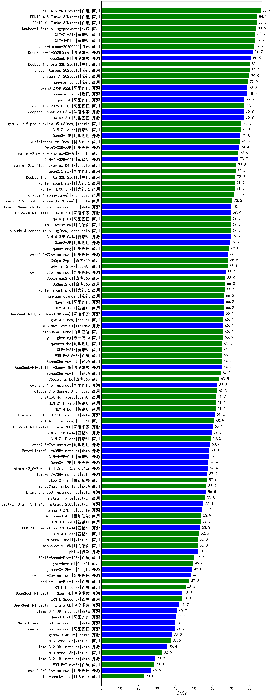

# LLM基础常见面试题（一）

## 1. 简单介绍一下大语言模型（LLMs）？

**大模型**：一般指1亿以上参数的模型，但是这个标准一直在升级，目前万亿参数以上的模型（例如：MinMax abab6.5）也有了。大语言模型（Large Language Models, LLMs）是针对语言的大模型。

大语言模型的关键特点包括：

1. **大规模参数**：LLMs拥有大量参数（如GPT-3的175B或PaLM的540B），参数数量越多，模型对语言的捕捉能力越强，可以更好地理解上下文和生成流畅的语言。

2. **多任务处理能力**：经过训练后，LLMs具备在多种语言任务上表现良好的能力，例如文本摘要、情感分析、机器翻译等。这是因为它们学会了在大数据集上归纳出各种语言模式和规律。

3. **上下文理解**：LLMs可以根据上下文生成逻辑和连贯的回应，这使得它们特别适合对话和内容创作任务。模型可以"记住"一段对话中的重要细节，并在后续对话中保持一致性。

4. **自监督学习**：大语言模型主要依赖自监督学习，使用未标注的数据进行训练，通过预测下一个词、填补空白或匹配句子等方式来学习语言结构。

5. **通用性和可扩展性**：LLMs可以迁移到多种任务和领域，经过少量微调就能在专门的任务（如医学文本分析或法律文件摘要）中发挥作用。

尽管大语言模型在许多任务上表现出色，但它们也有一些局限性，比如生成错误信息、偏见问题以及需要高昂的计算资源。

---

> ### 参考资料
不同尺寸大模型在中文的能力评测，目前已囊括115个大模型，覆盖ChatGPT、GPT-4o、百度文心一言、阿里通义千问、讯飞星火、商汤SenseChat、MinMax等商用模型，以及百川、Qwen2、GLM4、Yi、书生·浦语 InternLM2、Llama 3等开源大模型，多维度能力评测。

> **参考链接**：<https://github.com/jeinlee1991/chinese-llm-benchmark>

**综合能力得分为医疗、教育、金融、法律、行政公务、心理健康、推理与数学计算、语言与指令遵从等8个领域得分的平均值。**

**此榜单有PY交易可能。**

## 2. 大语言模型（LLMs）后面跟的 175B、60B、540B等指什么？

在大语言模型（LLMs）名称后面跟随的数字如"175B"、"60B"或"540B"指的是模型的参数数量（parameters），通常以"B"表示"billion"，即"十亿"。这些参数数量直接影响模型的复杂性和计算能力：

- **175B**：指的是模型有1750亿个参数，比如OpenAI的GPT-3。
- **60B**：指的是模型有600亿个参数，比如Meta的LLM模型版本之一。
- **540B**：指的是模型有5400亿个参数，比如Google的Pathways Language Model (PaLM)的较大版本。

参数数量越多，模型能学习和捕捉的语言模式和语义信息也越丰富，但对计算资源的要求也随之增加。更大的参数规模通常可以提高模型的性能，特别是在处理复杂任务或生成高质量文本时。不过，增加参数并不总是直接等于更好的效果，模型的优化、数据质量和训练方法也起着关键作用。