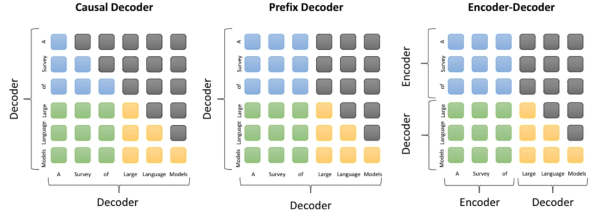
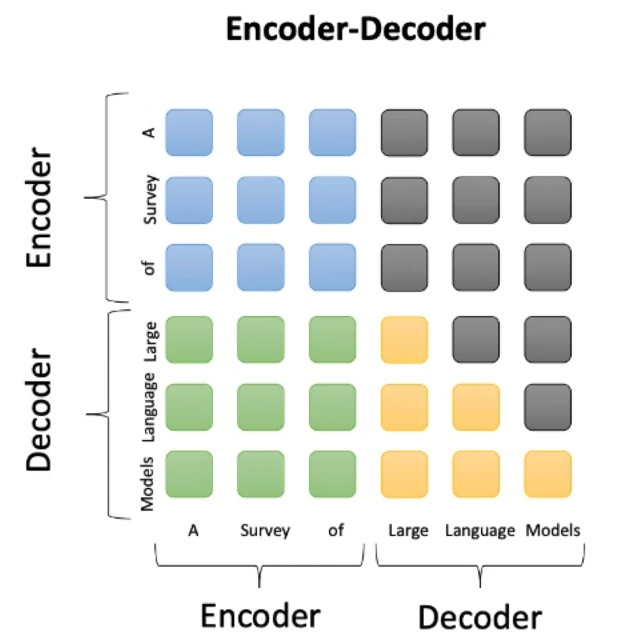
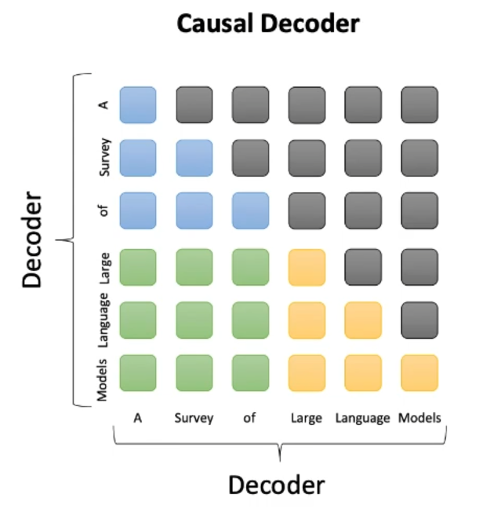
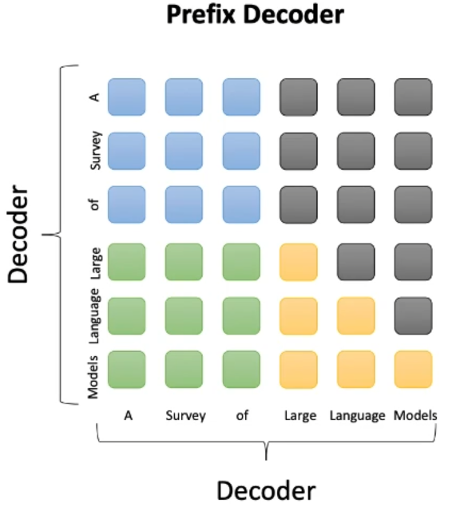

# LLM体系架构

## 5. 目前主流的LLMs开源模型体系有哪些？（Prefix Decoder, Causal Decoder 和 Encoder-Decoder 区别是什么？）

- 在预训练语言模型时代，自然语言处理领域广泛采用了**预训练 + 微调**的范式，并诞生了以 **BERT 为代表的编码器（Encoder-only）架构，以 GPT 为代表的解码器（Decoder-only）架构和以 T5 为代表的编码器-解码器（Encoder-decoder）架构**的大规模预训练语言模型。

- 随着 **GPT 系列模型的成功发展**，目前自然语言处理领域走向了**生成式语言模型**的道路，解码器架构已经成为了目前大语言模型的主流架构。进一步，解码器架构还可以细分为两个变种架构，包括**因果解码器（Causal Decoder）架构**和**前缀解码器（Prefix Decoder）架构**。值得注意的是，学术界所提到解码器架构时，通常指的都是因果解码器架构。

下图针对三种架构（Causal Decoder、Prefix Decoder 和 Encoder-Decoder）进行了对比：

### Encoder-Decoder

- Encoder-Decoder 架构是自然语言处理领域里一种经典的模型结构，广泛应用于如机器翻译等多项任务。原始的 Transformer 模型也使用了这一架构，组合了两个分别担任编码器和解码器的 Transformer 模块。

- 如下图所示，此架构**在编码器端采用了双向自注意力机制对输入信息进行编码处理，而在解码器端则使用了交叉注意力与掩码自注意力机制，进而通过自回归的方式对输出进行生成**。

- 基于编码器-解码器设计的预训练语言模型在众多自然语言理解与生成任务中展现出了优异的性能，但是目前只有如 FLAN-T5 等少数大语言模型是基于编码器-解码器架构建而成的。

    

### Causal Decoder

- Causal LM 是因果语言模型，目前流行的大多数模型都是这种结构，别无他因，因为 GPT 系列模型内部结构就是它，还有开源界的 LLaMa 也是。**Causal Decoder 架构的典型代表就是 GPT 系列模型，使用的是单向注意力掩码，以确保每个输入 token 只能注意到过去的 token 和它本身，输入和输出的 token 通过 Decoder 以相同的方式进行处理。**

- 在下图中，灰色代表对应的两个 token 互相之间看不到，否则就代表可以看到。例如，“Survery”可以看到前面的“A”，但是看不到后面的“of”。Causal Decoder 的 sequence mask 矩阵是一种典型的下三角矩阵。

- 在因果解码器架构中，最具有代表性的模型就是 OpenAI 推出的 GPT 系列。伴随着 GPT-3 的成功，因果解码器被广泛用于各种大语言模型中，包括 BLOOM、LLaMA（Meta）等。

    

### Prefix Decoder

- **Prefix Decoder 架构也被称为非因果解码器架构**，对于因果解码器的掩码机制进行了修改。该架构和因果解码器一样，仅仅使用了解码器组件。

- 与之不同的是，该架构参考了编码器-解码器的设计，对于输入和输出部分进行了特定处理。如下图所示，**前缀解码器对于输入（前缀）部分使用双向注意力进行编码，而对于输出部分利用单向的掩码注意力利用该词元本身和前面的词元进行自回归地预测。**

- 与编码器-解码器不同的是，前缀解码器在编码和解码过程中是共享参数的，并没有划分为独立的解码器和编码器。

- 当前，基于前缀解码器架构的代表性大语言模型包括 GLM-130B 和 U-PaLM（Google）。

### 总结

Prefix Decoder、Causal Decoder 和 Encoder-Decoder 区别在于 attention mask 不同

- **Encoder-Decoder（代表：T5）**：
    - 在输入上采用双向注意力，对问题的编码理解更充分；
    - 适用任务：在偏理解的 NLP 任务上效果好；
    - 在长文本生成任务上效果差，训练效率低；

- **Causal Decoder（代表：GPT 系列）**：
    - 自回归语言模型，预训练和下游应用是完全一致的，严格遵守只有后面的 token 才能看到前面的 token 的规则；
    - 适用任务：文本生成任务效果好；
    - 训练效率高，zero-shot 能力更强，具有涌现能力；

- **Prefix Decoder（代表：GLM）**：
    - 特点：prefix 部分的 token 互相能看到；
    - 适用任务：文本生成任务效果好；
