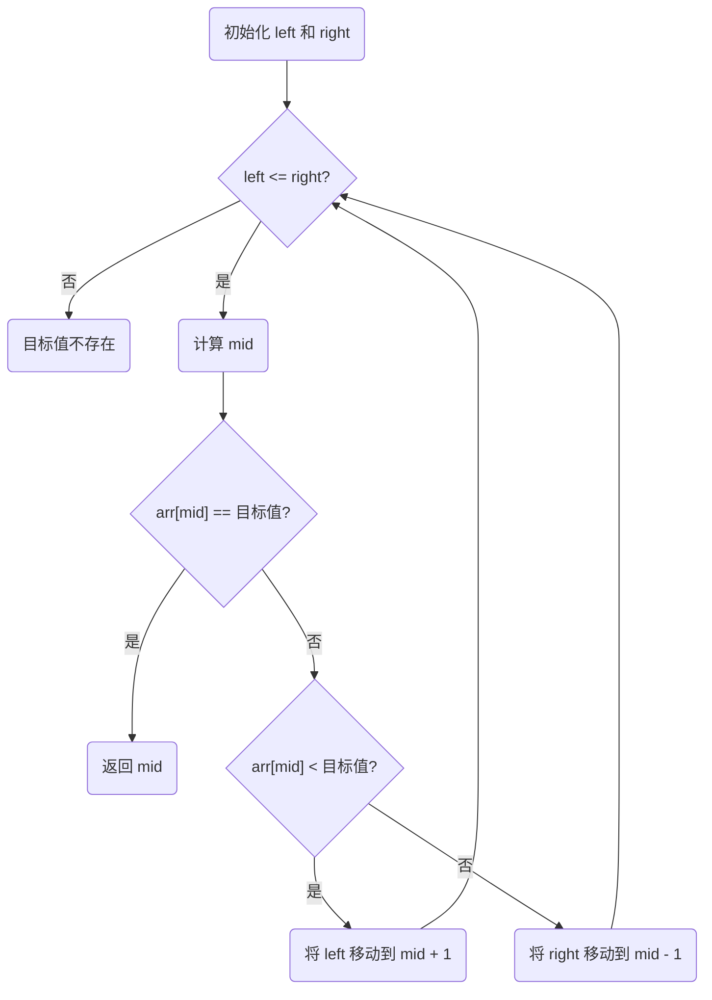

---
date:
    created: 2024-10-04
---
# 二分查找（Binary Search）算法

二分查找（Binary Search）是一种高效的搜索算法，适用于有序数组。它通过每次将搜索区间缩小一半，从而极大地减少了查找的时间复杂度。该算法的时间复杂度为 $O(log n)$，适用于查找范围大、数据量多的情况。

## 步骤

1. **初始化指针**：设定左指针 `left` 为数组的起始索引，右指针 `right` 为数组的末尾索引。
2. **计算中间位置**：计算中间位置 `mid = (left + right) // 2`。
3. **比较中间值**：
    - 如果目标值等于中间值，返回索引。
    - 如果目标值小于中间值，移动右指针到 `mid - 1`，继续在左半部分查找。
    - 如果目标值大于中间值，移动左指针到 `mid + 1`，继续在右半部分查找。
4. **结束条件**：当左指针超过右指针时，表示目标值不存在于数组中。

## 流程图

## 一个栗子

假设有序数组为 `[2, 4, 6, 8, 10, 12, 14, 16, 18, 20]`，我们要查找目标值 14。下面是每一步的示意图，其中考虑序列由 ``红色标出，而中间值由 ``**加粗的绿色**标出：

| 步骤 |                                   数组                                   | 左指针 | 右指针 | 中间值 |
| :--: | :----------------------------------------------------------------------: | :----: | :----: | :----: |
|  1  | $[{\color{red}2, 4, 6, 8, {\color{green}\bf 10}, 12, 14, 16, 18, 20]}$ |   0   |   9   |   4   |
|  2  | $[2, 4, 6, 8, 10, {\color{red}12, 14, {\color{green}\bf 16}, 18, 20]}$ |   5   |   9   |   7   |
|  3  | $[2, 4, 6, 8, 10, {\color{red}{\color{green}\bf 12}, 14}, 16, 18, 20]$ |   5   |   6   |   5   |
|  4  |       $[2, 4, 6, 8, 10, 12, {\color{green} \bf 14}, 16, 18, 20]$       |   6   |   6   |   6   |

在步骤 4 中，目标值 ``14 位于中间位置，查找成功，返回索引 6。

## 代码

=== "Tab 1"
    Markdown **content**.

    Multiple paragraphs.

=== "Tab 2"
    More Markdown **content**.

    - list item a
    - list item b
