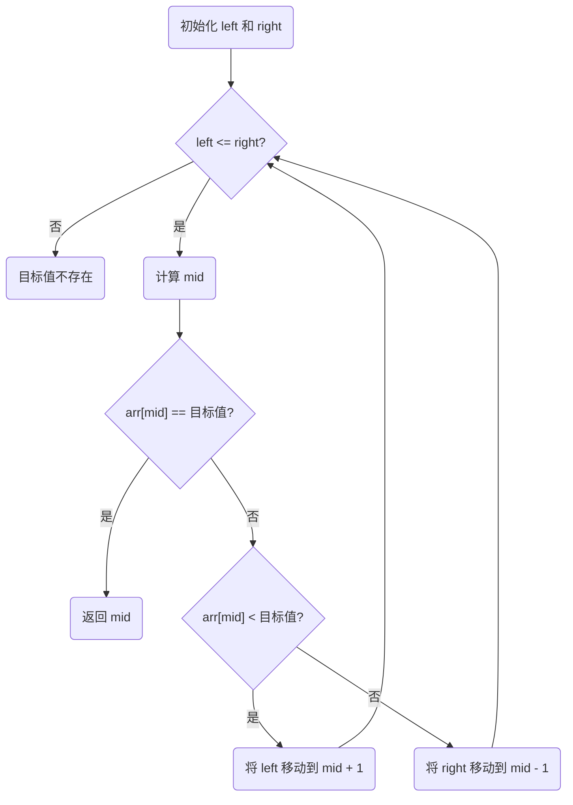

---
date:
    created: 2024-10-04
---
# 二分查找（Binary Search）算法

二分查找（Binary Search）是一种高效的搜索算法，适用于有序数组。它通过每次将搜索区间缩小一半，从而极大地减少了查找的时间复杂度。该算法的时间复杂度为 $O(\log n)$，适用于查找范围大、数据量多的情况。

## 特点
**优点**

- 在长序列查找时，速度很快

**缺点**

- 查找序列需要先排序，排序最快的复杂度为 $O(n\log n)$

## 步骤

1. **初始化指针**：设定左指针 `left` 为数组的起始索引，右指针 `right` 为数组的末尾索引。
2. **计算中间位置**：计算中间位置 `mid = (left + right) // 2`。
3. **比较中间值**：
    - 如果目标值等于中间值，返回索引。
    - 如果目标值小于中间值，移动右指针到 `mid - 1`，继续在左半部分查找。
    - 如果目标值大于中间值，移动左指针到 `mid + 1`，继续在右半部分查找。
4. **结束条件**：当左指针超过右指针时，表示目标值不存在于数组中。

## 流程图



## 一个栗子

假设有序数组为 `[2, 4, 6, 8, 10, 12, 14, 16, 18, 20]`，序列总长度为10，我们要查找目标值 14。下面是每一步的示意图，其中考虑序列由$\color{red}{红色}$标出，而中间值由$\color{green} \bf {加粗的绿色}$标出：

| 步骤 |                                   数组                                   | 左指针 | 右指针 | 中间值 |
| :--: | :----------------------------------------------------------------------: | :----: | :----: | :----: |
|  1  | $[{\color{red}2, 4, 6, 8, {\color{green}\bf 10}, 12, 14, 16, 18, 20]}$ |   0   |   9   |   4   |
|  2  | $[2, 4, 6, 8, 10, {\color{red}12, 14, {\color{green}\bf 16}, 18, 20]}$ |   5   |   9   |   7   |
|  3  | $[2, 4, 6, 8, 10, {\color{red}{\color{green}\bf 12}, 14}, 16, 18, 20]$ |   5   |   6   |   5   |
|  4  |       $[2, 4, 6, 8, 10, 12, {\color{green} \bf 14}, 16, 18, 20]$       |   6   |   6   |   6   |

在步骤 4 中，目标值 $\color{green} \bf {14}$ 位于中间位置，查找成功，返回索引6。

## 代码

=== "🔵 Python"
    ```python
    def binary_search(arr, target):
        left = 0
        right = len(arr) - 1

        while left <= right:
            mid = (left + right) // 2

            if arr[mid] == target:
                return mid
            elif arr[mid] < target:
                left = mid + 1
            else:
                right = mid - 1

        return -1

    if __name__ == '__main__':
        arr = [2, 4, 6, 8, 10, 12, 14, 16, 18, 20]
        target = 14
        res = binary_search(arr, target)
        print(f'{target}在位置{res}' if res >= 0 else '{target}不在数组中')
    ```

    ??? success "可视化代码 [:material-open-in-new:](https://pythontutor.com/iframe-embed.html#code=def%20binary_search%28arr,%20target%29%3A%0A%20%20%20%20left%20%3D%200%0A%20%20%20%20right%20%3D%20len%28arr%29%20-%201%0A%0A%20%20%20%20while%20left%20%3C%3D%20right%3A%0A%20%20%20%20%20%20%20%20mid%20%3D%20%28left%20%2B%20right%29%20//%202%0A%0A%20%20%20%20%20%20%20%20if%20arr%5Bmid%5D%20%3D%3D%20target%3A%0A%20%20%20%20%20%20%20%20%20%20%20%20return%20mid%0A%20%20%20%20%20%20%20%20elif%20arr%5Bmid%5D%20%3C%20target%3A%0A%20%20%20%20%20%20%20%20%20%20%20%20left%20%3D%20mid%20%2B%201%0A%20%20%20%20%20%20%20%20else%3A%0A%20%20%20%20%20%20%20%20%20%20%20%20right%20%3D%20mid%20-%201%0A%0A%20%20%20%20return%20-1%0A%0Aif%20__name__%20%3D%3D%20'__main__'%3A%0A%20%20%20%20arr%20%3D%20%5B2,%204,%206,%208,%2010,%2012,%2014,%2016,%2018,%2020%5D%0A%20%20%20%20target%20%3D%2014%0A%20%20%20%20res%20%3D%20binary_search%28arr,%20target%29%0A%20%20%20%20print%28f'%7Btarget%7D%E5%9C%A8%E4%BD%8D%E7%BD%AE%7Bres%7D'%20if%20res%20%3E%3D%200%20else%20'%7Btarget%7D%E4%B8%8D%E5%9C%A8%E6%95%B0%E7%BB%84%E4%B8%AD'%29&codeDivHeight=400&codeDivWidth=350&cumulative=false&curInstr=1&heapPrimitives=nevernest&origin=opt-frontend.js&py=311&rawInputLstJSON=%5B%5D&textReferences=false){:target="\_blank"}"

        <iframe width="800" height="500" frameborder="0" src="https://pythontutor.com/iframe-embed.html#code=def%20binary_search%28arr,%20target%29%3A%0A%20%20%20%20left%20%3D%200%0A%20%20%20%20right%20%3D%20len%28arr%29%20-%201%0A%0A%20%20%20%20while%20left%20%3C%3D%20right%3A%0A%20%20%20%20%20%20%20%20mid%20%3D%20%28left%20%2B%20right%29%20//%202%0A%0A%20%20%20%20%20%20%20%20if%20arr%5Bmid%5D%20%3D%3D%20target%3A%0A%20%20%20%20%20%20%20%20%20%20%20%20return%20mid%0A%20%20%20%20%20%20%20%20elif%20arr%5Bmid%5D%20%3C%20target%3A%0A%20%20%20%20%20%20%20%20%20%20%20%20left%20%3D%20mid%20%2B%201%0A%20%20%20%20%20%20%20%20else%3A%0A%20%20%20%20%20%20%20%20%20%20%20%20right%20%3D%20mid%20-%201%0A%0A%20%20%20%20return%20-1%0A%0Aif%20__name__%20%3D%3D%20'__main__'%3A%0A%20%20%20%20arr%20%3D%20%5B2,%204,%206,%208,%2010,%2012,%2014,%2016,%2018,%2020%5D%0A%20%20%20%20target%20%3D%2014%0A%20%20%20%20res%20%3D%20binary_search%28arr,%20target%29%0A%20%20%20%20print%28f'%7Btarget%7D%E5%9C%A8%E4%BD%8D%E7%BD%AE%7Bres%7D'%20if%20res%20%3E%3D%200%20else%20'%7Btarget%7D%E4%B8%8D%E5%9C%A8%E6%95%B0%E7%BB%84%E4%B8%AD'%29&codeDivHeight=400&codeDivWidth=350&cumulative=false&curInstr=1&heapPrimitives=nevernest&origin=opt-frontend.js&py=311&rawInputLstJSON=%5B%5D&textReferences=false"> </iframe>

=== "🔴 C++"
    ```C++
    #include <iostream>
    #include <vector>

    using namespace std;

    int binary_search(vector<int>& arr, int target) {
        int left = 0;
        int right = arr.size() - 1;

        while (left <= right) {
            int mid = (left + right) / 2;

            if (arr[mid] == target) {
                return mid;
            } else if (arr[mid] < target) {
                left = mid + 1;
            } else {
                right = mid - 1;
            }
        }

        return -1;
    }

    int main() {
        vector<int> arr = {2, 4, 6, 8, 10, 12, 14, 16, 18, 20};
        int target = 14;
        int res = binary_search(arr, target);

        if (res >= 0) {
            cout << target << "在位置" << res << endl;
        } else {
            cout << target << "不在数组中" << endl;
        }

        return 0;
    }
    ```
    ??? success "可视化代码 [:material-open-in-new:](https://pythontutor.com/iframe-embed.html#code=%23include%20%3Ciostream%3E%0A%23include%20%3Cvector%3E%0A%0Ausing%20namespace%20std%3B%0A%0Aint%20binary_search%28vector%3Cint%3E%26%20arr,%20int%20target%29%20%7B%0A%20%20%20%20int%20left%20%3D%200%3B%0A%20%20%20%20int%20right%20%3D%20arr.size%28%29%20-%201%3B%0A%0A%20%20%20%20while%20%28left%20%3C%3D%20right%29%20%7B%0A%20%20%20%20%20%20%20%20int%20mid%20%3D%20%28left%20%2B%20right%29%20/%202%3B%0A%0A%20%20%20%20%20%20%20%20if%20%28arr%5Bmid%5D%20%3D%3D%20target%29%20%7B%0A%20%20%20%20%20%20%20%20%20%20%20%20return%20mid%3B%0A%20%20%20%20%20%20%20%20%7D%20else%20if%20%28arr%5Bmid%5D%20%3C%20target%29%20%7B%0A%20%20%20%20%20%20%20%20%20%20%20%20left%20%3D%20mid%20%2B%201%3B%0A%20%20%20%20%20%20%20%20%7D%20else%20%7B%0A%20%20%20%20%20%20%20%20%20%20%20%20right%20%3D%20mid%20-%201%3B%0A%20%20%20%20%20%20%20%20%7D%0A%20%20%20%20%7D%0A%0A%20%20%20%20return%20-1%3B%0A%7D%0A%0Aint%20main%28%29%20%7B%0A%20%20%20%20vector%3Cint%3E%20arr%20%3D%20%7B2,%204,%206,%208,%2010,%2012,%2014,%2016,%2018,%2020%7D%3B%0A%20%20%20%20int%20target%20%3D%2014%3B%0A%20%20%20%20int%20res%20%3D%20binary_search%28arr,%20target%29%3B%0A%0A%20%20%20%20if%20%28res%20%3E%3D%200%29%20%7B%0A%20%20%20%20%20%20%20%20cout%20%3C%3C%20target%20%3C%3C%20%22%E5%9C%A8%E4%BD%8D%E7%BD%AE%22%20%3C%3C%20res%20%3C%3C%20endl%3B%0A%20%20%20%20%7D%20else%20%7B%0A%20%20%20%20%20%20%20%20cout%20%3C%3C%20target%20%3C%3C%20%22%E4%B8%8D%E5%9C%A8%E6%95%B0%E7%BB%84%E4%B8%AD%22%20%3C%3C%20endl%3B%0A%20%20%20%20%7D%0A%0A%20%20%20%20return%200%3B%0A%7D&codeDivHeight=400&codeDivWidth=350&cumulative=false&curInstr=0&heapPrimitives=nevernest&origin=opt-frontend.js&py=cpp_g%2B%2B9.3.0&rawInputLstJSON=%5B%5D&textReferences=false){:target="\_blank"}"

        <iframe width="800" height="500" frameborder="0" src="https://pythontutor.com/iframe-embed.html#code=%23include%20%3Ciostream%3E%0A%23include%20%3Cvector%3E%0A%0Ausing%20namespace%20std%3B%0A%0Aint%20binary_search%28vector%3Cint%3E%26%20arr,%20int%20target%29%20%7B%0A%20%20%20%20int%20left%20%3D%200%3B%0A%20%20%20%20int%20right%20%3D%20arr.size%28%29%20-%201%3B%0A%0A%20%20%20%20while%20%28left%20%3C%3D%20right%29%20%7B%0A%20%20%20%20%20%20%20%20int%20mid%20%3D%20%28left%20%2B%20right%29%20/%202%3B%0A%0A%20%20%20%20%20%20%20%20if%20%28arr%5Bmid%5D%20%3D%3D%20target%29%20%7B%0A%20%20%20%20%20%20%20%20%20%20%20%20return%20mid%3B%0A%20%20%20%20%20%20%20%20%7D%20else%20if%20%28arr%5Bmid%5D%20%3C%20target%29%20%7B%0A%20%20%20%20%20%20%20%20%20%20%20%20left%20%3D%20mid%20%2B%201%3B%0A%20%20%20%20%20%20%20%20%7D%20else%20%7B%0A%20%20%20%20%20%20%20%20%20%20%20%20right%20%3D%20mid%20-%201%3B%0A%20%20%20%20%20%20%20%20%7D%0A%20%20%20%20%7D%0A%0A%20%20%20%20return%20-1%3B%0A%7D%0A%0Aint%20main%28%29%20%7B%0A%20%20%20%20vector%3Cint%3E%20arr%20%3D%20%7B2,%204,%206,%208,%2010,%2012,%2014,%2016,%2018,%2020%7D%3B%0A%20%20%20%20int%20target%20%3D%2014%3B%0A%20%20%20%20int%20res%20%3D%20binary_search%28arr,%20target%29%3B%0A%0A%20%20%20%20if%20%28res%20%3E%3D%200%29%20%7B%0A%20%20%20%20%20%20%20%20cout%20%3C%3C%20target%20%3C%3C%20%22%E5%9C%A8%E4%BD%8D%E7%BD%AE%22%20%3C%3C%20res%20%3C%3C%20endl%3B%0A%20%20%20%20%7D%20else%20%7B%0A%20%20%20%20%20%20%20%20cout%20%3C%3C%20target%20%3C%3C%20%22%E4%B8%8D%E5%9C%A8%E6%95%B0%E7%BB%84%E4%B8%AD%22%20%3C%3C%20endl%3B%0A%20%20%20%20%7D%0A%0A%20%20%20%20return%200%3B%0A%7D&codeDivHeight=400&codeDivWidth=350&cumulative=false&curInstr=0&heapPrimitives=nevernest&origin=opt-frontend.js&py=cpp_g%2B%2B9.3.0&rawInputLstJSON=%5B%5D&textReferences=false"> </iframe>

## 延展 (找到第一个大于等于target的数)

给定一个排序数组和一个目标值，在数组中找到目标值，并返回其索引。如果目标值不存在于数组中，返回它将会被按顺序插入的位置。
请必须使用时间复杂度为 $O(\log n)$ 的算法。([Leetcode](https://leetcode.cn/problems/search-insert-position/description/?envType=problem-list-v2&envId=array))

=== "🔵 Python"
    ```python
    def searchInsert(nums: List[int], target: int) -> int:
        left, right = 0, len(nums)-1
        while left <= right:
            mid = (left + right) // 2
            if nums[mid] < target:
                left = mid+1
            else:
                right = mid-1
        return left
    ```

如果改为找到第一个**大于** `target` 的数，则将代码的第5行改为 `if nums[mid] <= target:`