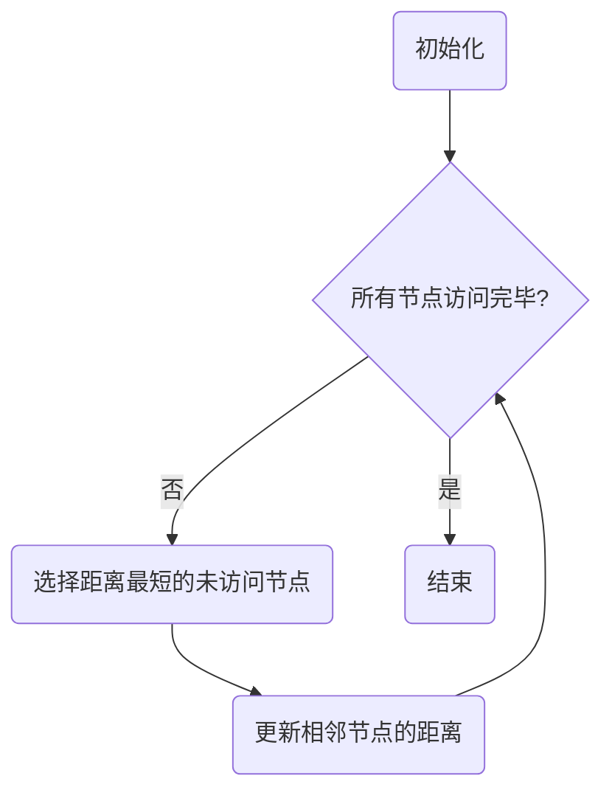
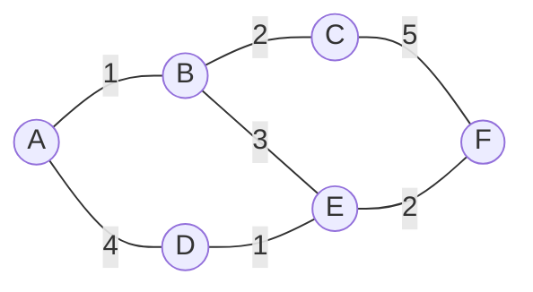

# Dijkstra算法

Dijkstra算法是一种经典的用于求解**单源最短路径问题**的贪心算法。它能够在加权图中找到从起始节点到所有其他节点的最短路径，前提是所有边的权重都是非负的。该算法广泛应用于诸如网络路由、地图导航等领域。

## 算法特点

**优点**：
- 适用于边权非负的有向图和无向图。
- 可以在边权较小且图较稠密时高效运行。

**缺点**：
- 不能处理包含负权边的图（如有负权边，可使用Bellman-Ford算法）。
- 对于稀疏图，使用邻接表表示可以提高性能。

## 算法步骤

1. **初始化**：
    - 将所有节点的最短路径估值初始化为无穷大，起点的最短路径值设为0。
    - 维护一个**已访问集合**，用于标记已确定最短路径的节点。
2. **选取未访问节点中最小的节点**：
    - 在未访问的节点中选择距离起点最短的节点$u$，并标记为已访问。
3. **更新相邻节点的路径**：
    - 遍历节点$u$的所有邻居节点$v$，如果通过$u$到$v$的路径比当前已知的路径短，则更新$v$的最短路径值。
4. **重复**：
    - 重复步骤2和步骤3，直到所有节点都被访问，或者已访问节点的距离都为无穷大（图可能是非连通图）。
5. **结束**：
    - 最终，所有节点的最短路径都被计算出来。

## 流程图



## 一个栗子

假设有一个加权图，其中包含5个节点，边的权重如下所示：（注意下图是无向图，mermaid抽风了）





目标是从节点 A 出发，找到到其他节点的最短路径。下表展示了 Dijkstra 算法的每一步执行过程：

| 步骤 | 已访问节点   | 节点 A 的最短路径 | 节点 B 的最短路径 | 节点 C 的最短路径 | 节点 D 的最短路径 | 节点 E 的最短路径 | 节点 F 的最短路径 |
|:---:|:-------------:|:----------------:|:----------------:|:----------------:|:----------------:|:----------------:|:----------------:|
|  1  | A             | 0                | 1                | ∞                | 4                | ∞                | ∞                |
|  2  | A, B          | 0                | 1                | 3                | 4                | 4               | ∞                |
|  3  | A, B, C       | 0                | 1                | 3                | 4                | 4                | 8                |
|  4  | A, B, C, D    | 0                | 1                | 3                | 4                | 4                | 8                |
|  5  | A, B, C, D, E | 0                | 1                | 3                | 4                | 4                | 6                |


最终，节点 A 到其他所有节点的最短路径分别为：A->B(1)，A->C(3)，A->D(4)，A->E(4)，A->F(6)。

## 代码

=== "🔵 Python"
    ```python
    import heapq

    def dijkstra(graph, start):
        queue = []
        heapq.heappush(queue, (0, start))
        distances = {node: float('inf') for node in graph}
        distances[start] = 0
        previous_nodes = {node: None for node in graph}

        while queue:
            current_distance, current_node = heapq.heappop(queue)

            if current_distance > distances[current_node]:
                continue

            for neighbor, weight in graph[current_node].items():
                distance = current_distance + weight

                if distance < distances[neighbor]:
                    distances[neighbor] = distance
                    previous_nodes[neighbor] = current_node
                    heapq.heappush(queue, (distance, neighbor))

        return distances, previous_nodes

    # 示例图
    graph = {
        'A': {'B': 1, 'D': 4},
        'B': {'A': 1, 'C': 2, 'E': 3},
        'C': {'B': 2, 'F': 5},
        'D': {'A': 4, 'E': 1},
        'E': {'B': 3, 'D': 1, 'F': 2},
        'F': {'C': 5, 'E': 2}
    }

    distances, previous_nodes = dijkstra(graph, 'A')
    print("Distances:", distances)
    print("Previous Nodes:", previous_nodes)
    ```

=== "🔴 C++"
    ```C++
    comming soon
    ```